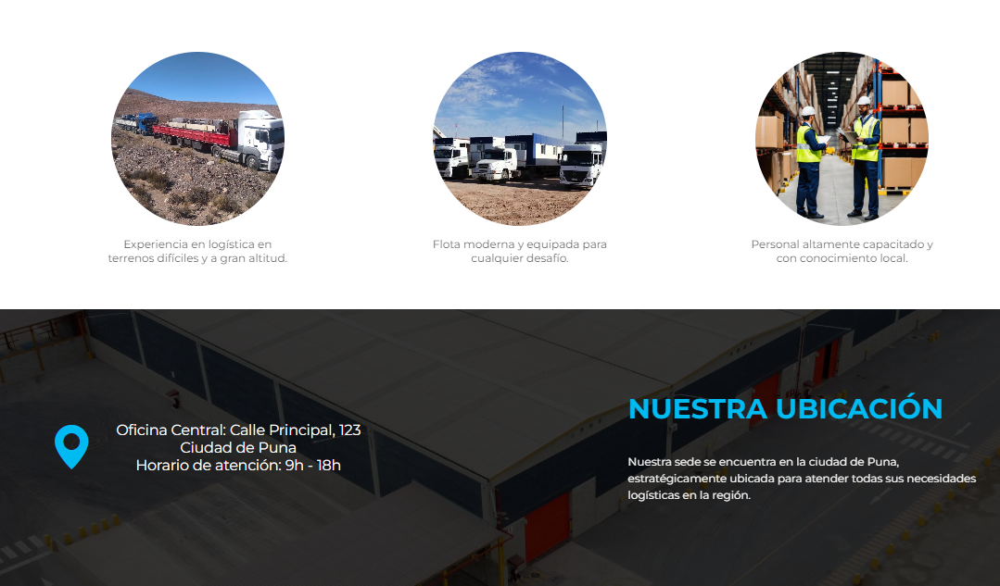

# Landing Page de Logística

Este proyecto consiste en una **Landing Page** diseñada para una página web dedicada a **servicios logísticos** en la región de la puna. Está desarrollada con HTML y CSS, con el objetivo de proporcionar una interfaz visual atractiva y funcional para promover los servicios de logística.

## 🚀 Características

- Diseño responsivo para adaptarse a dispositivos móviles y de escritorio.
- Información clara sobre los servicios de logística.
- Sección de contacto para facilitar la comunicación con los clientes.
- Imagen de fondo y elementos gráficos visualmente atractivos.

## 🖥️ Cómo ejecutar el proyecto

1. Clona este repositorio en tu máquina local:
    ```bash
    git clone https://github.com/FJMoisesRomero/Landing-Page-Logistica.git
    ```

2. Abre el archivo `index.html` en tu navegador:
    ```bash
    index.html
    ```
## Visitalo en https://fjmoisesromero.github.io/Landing-Page-Logistica/

## 📸 Capturas del proyecto





## 🤝 Contribuciones

Este proyecto fue realizado con fines educativos, pero cualquier sugerencia o mejora es bienvenida. Si deseas contribuir:

1. Haz un fork del repositorio.
2. Crea una rama con tus cambios: `git checkout -b feature/nueva-mejora`.
3. Realiza un pull request. 🚀

## 📝 Licencia

Este proyecto es un aporte a la comunidad, sientete libre de usarlo.

